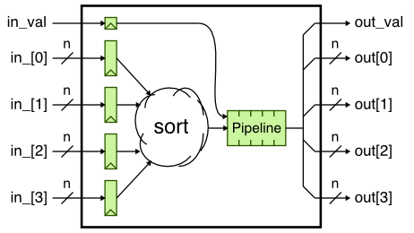
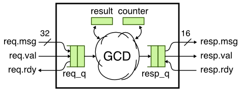

ECE 5745 PyMTL CL Modeling
==========================================================================

Most students are quite familiar with functional-level (FL) and
register-transfer-level (RTL) modeling from ECE 4750, but students are
often less familar with cycle-level (CL) modeling. Here is a reminder of
the differences between these modeling levels:

 - **Functional-Level:** FL models implement the functionality but not
   the timing of the hardware target. FL models are useful for exploring
   algorithms, performing fast emulation of hardware targets, and
   creating golden models for verification of CL and RTL models. FL
   models can also be used for building sophisticated test harnesses. FL
   models are usually the easiest to construct, but also the least
   accurate with respect to the target hardware.

 - **Cycle-Level:** CL models capture the cycle-approximate behavior of a
   hardware target. CL models will often augment the functional behavior
   with an additional timing model to track the performance of the
   hardware target in cycles. CL models are usually specifically designed
   to enable rapid design- space exploration of cycle-level performance
   across a range of microarchitectural design parameters. CL models
   attempt to strike a balance between accuracy, performance, and
   flexibility.

 - **Register-Transfer-Level:** RTL models are cycle-accurate,
   resource-accurate, and bit-accurate represen- tations of hardware. RTL
   models are built for the purpose of verification and synthesis of
   specific hardware implementations. RTL models can be used to drive EDA
   toolflows for estimating area, energy, and timing. RTL models are
   usually the most tedious to construct, but also the most accurate with
   respect to the target hardware.

The tutorial on PyMTL introduced all three levels of modeling, but we
review the CL models for the sort unit and GCD unit here. The first step
is to source the setup script, clone this repository from GitHub, and
make a build directory to work in.

```
 % source setup-ece5745.sh
 % mkdir $HOME/ece5745
 % cd $HOME/ece5745
 % git clone git@github.com:cornell-ece5745/ece5745-sec-pymtl-cl
 % mkdir -p ece5745-sec-pymtl-cl/pymtl/build
 % cd ece5745-sec-pymtl-cl/pymtl/build
```

The following figure illustrates the sort unit CL model. We immediately
sort the input values in a single cycle and then we delay the outputting
the results by several cycles to model the pipeline latency. The key to
CL modeling is to capture the cycle-level behavior (i.e., how long a
transaction takes) without worrying about the bit-level details or the
exact hardware structures required to implement the desired cycle-level
behavior.



Here is the corresponding code for the sort unit CL model.

```python
class SortUnitCL( Model ):

  def __init__( s, nbits=8, nstages=3 ):

    s.in_val  = InPort (1)
    s.in_     = [ InPort  (nbits) for _ in range(4) ]

    s.out_val = OutPort(1)
    s.out     = [ OutPort (nbits) for _ in range(4) ]

    s.pipe    = deque( [[0,0,0,0,0]]*(nstages-1) )

    @s.tick_cl
    def block():
      s.pipe.append( deepcopy( [s.in_val] + sorted(s.in_) ) )
      data = s.pipe.popleft()
      s.out_val.next = data[0]
      for i, v in enumerate( data[1:] ):
        s.out[i].next = v
```

Notice how we use a `deque` to model the pipeline behavior. Each entry in
the `deque` has a valid bit and then the four sorted values. Also notice
how we need to use a `deepcopy` to ensure that we really do have a copy
of the sorted values in the `deque` and not just a reference. Let's run
the sort unit CL tests and then produce a line trace:

```
 % py.test ../tut3_pymtl/sort/SortUnitCL_test.py
 % py.test ../tut3_pymtl/sort/SortUnitCL_test.py -k test[2stage_stream] -s

  2: {04,03,02,01}|
  3: {09,06,07,01}|
  4: {04,08,00,09}|{01,02,03,04}
  5:              |{01,06,07,09}
  6:              |{00,04,08,09}
```

We can see that the first transaction goes into the sort unit on cycle 2
and then comes out of the sort unit on cycle 4. The sort unit CL model is
modeling a two-stage pipeline. Since CL modeling is a higher level
modeling abstraction from RTL modeling, it is much easier to experiment
with different parameters. For example, we can easily experiment with
longer latency sort units and analyze the impact the sort latency has on
the full system cycle-level performance.

The following figure illustrates the GCD unit CL model. Unlike the sort
unit CL model, here we want to model an interative unit. In this case we
can simply do the GCD immediately in a single cycle and then use a
counter to wait a certain number of cycles which should roughly
approximate how long the real hardware will require to calculate the GCD.



Here is the code used to estimate the number of cycles:

```python
def gcd( a, b ):

  ncycles = 0
  while True:
    ncycles += 1
    if a < b:
      a,b = b,a
    elif b != 0:
      a = a - b
    else:
      return (a,ncycles)
```

Let's run the GCD unit CL tests and then produce a line trace:

```
 % py.test ../tut3_pymtl/gcd/GcdUnitCL_test.py
 % py.test ../tut3_pymtl/gcd/GcdUnitCL_test.py -k test[basic_0x0] -s

  2:           >          ().    > .
  3: 000f:0005 > 000f:0005()     >
  4: 0003:0009 > 0003:0009()     >
  5: #         > #        ()     >
  6: #         > #        ()     >
  7: #         > #        ()     >
  8: #         > #        ()     >
  9: #         > #        ()0005 > 0005
 10: 0000:0000 > 0000:0000()     >
 11: #         > #        ()     >
 12: #         > #        ()     >
 13: #         > #        ()     >
 14: #         > #        ()     >
 15: #         > #        ()     >
 16: #         > #        ()0003 > 0003
 17: 001b:000f > 001b:000f()     >
 18: #         > #        ()0000 > 0000
 19: 0015:0031 > 0015:0031()     >
 20: #         > #        ()     >
 21: #         > #        ()     >
 22: #         > #        ()     >
 23: #         > #        ()     >
 24: #         > #        ()     >
 25: #         > #        ()     >
 26: #         > #        ()     >
 27: #         > #        ()     >
 28: #         > #        ()     >
 29: #         > #        ()0003 > 0003
```

Now let's assume we want to experiment with the impact of a hardware
optimization that combines the a swap and subtract operation into a
single step. We simply need to change our code that estimates the number
of cycles to something like this:

```python
def gcd( a, b ):

  ncycles = 0
  while True:
    ncycles += 1
    if a < b:
      a,b = b-a,a
    elif b != 0:
      a = a - b
    else:
      return (a,ncycles)
```

Notice how we now also do a subtraction at the same time we swap `a` and
`b`. The resulting line trace is now:

```
  2:           >          ().    > .
  3: 000f:0005 > 000f:0005()     >
  4: 0003:0009 > 0003:0009()     >
  5: #         > #        ()     >
  6: #         > #        ()     >
  7: #         > #        ()     >
  8: #         > #        ()     >
  9: #         > #        ()0005 > 0005
 10: 0000:0000 > 0000:0000()     >
 11: #         > #        ()     >
 12: #         > #        ()     >
 13: #         > #        ()     >
 14: #         > #        ()     >
 15: #         > #        ()0003 > 0003
 16: 001b:000f > 001b:000f()     >
 17: #         > #        ()0000 > 0000
 18: 0015:0031 > 0015:0031()     >
 19: #         > #        ()     >
 20: #         > #        ()     >
 21: #         > #        ()     >
 22: #         > #        ()     >
 23: #         > #        ()     >
 24: #         > #        ()     >
 25: #         > #        ()     >
 26: #         > #        ()0003 > 0003
```

Our model now suggests the GCD unit will finish four transactions on
cycle 26 instead of finishing on cycle 29. Conducting a similar
experiment in an RTL model would require significant changes to the
datapath and control unit, while experimenting with such cycle-level
behavior in a CL model is much easier.

gem5 Example Output
--------------------------------------------------------------------------

==========================================================================
gem5 Pipeline Diagrams
==========================================================================

Here is an example of an assembly version of vvadd running on the gem5
four-way OOO processor. We show the output from the gem5 pipeline viewer,
but then we also show a version which we have manually written that uses
the syntax we learn in ECE 4750.

```
 [dn.ic...............r..........................................................f] 0x00808020.0 lw r6, 0(r2)
 [dn.pic..............r..........................................................f] 0x00808024.0 lw r7, 0(r3)
 [dn.p..............ic.r.........................................................f] 0x00808028.0 addu r8, r6, r7
 [dn.p...............ic.r........................................................f] 0x0080802c.0 sw r8, 0(r4)
 [fdn.ic................r.........................................................] 0x00808030.0 addiu r2, r2, 4
 [fdn.ic................r.........................................................] 0x00808034.0 addiu r3, r3, 4
 [fdn.ic................r.........................................................] 0x00808038.0 addiu r4, r4, 4
 [fdn..ic................r........................................................] 0x0080803c.0 addiu r5, r5, 1
 [.fdn..ic...............r........................................................] 0x00808040.0 bne r5, r1, 0x808020
 [..f..dn.ic.............r........................................................] 0x00808020.0 lw r6, 0(r2)
 [..f..dn.pic............r........................................................] 0x00808024.0 lw r7, 0(r3)
 [..f..dn.p.........ic....r.......................................................] 0x00808028.0 addu r8, r6, r7
 [..f..dn.p...........ic..r.......................................................] 0x0080802c.0 sw r8, 0(r4)
 [......fdn.ic............r.......................................................] 0x00808030.0 addiu r2, r2, 4
 [......fdn.ic............r.......................................................] 0x00808034.0 addiu r3, r3, 4
 [......fdn.ic.............r......................................................] 0x00808038.0 addiu r4, r4, 4
 [......fdn.ic.............r......................................................] 0x0080803c.0 addiu r5, r5, 1
 [.......fdn.pic...........r......................................................] 0x00808040.0 bne r5, r1, 0x808020

 - f = fetch stage, d = decode stage, n = rename stage
 - . after n is always an extra "ROB allocation" stage
 - p = "dispatch", we think this is similar to how we show an i when an
       instruction goes into the IQ
 - c = complete stage, this seems to be the same as an X stage

 - i = issue stage, for long latency operations the "latency" happens
       while the instruction is in the issue queue and then you see the i
       at the end right before the instruction is complete. so you will
       not see more than one i or c for a long latency instruction

 - . after c stage, we think this is similar to our W stage
 - r = retire stage, this is similar to our C stage
```

```
                       0 1 2 3 4 5 6 7 8 9 0 1 2 3 4 5 6 7 8 9 0 1 2 3 4 5 6
 ----------------------------------------------------------------------------
 lw r6, 0(r2)          F D N R I X q . . . . . . . . . . M W r . C            lw goes into LSQ, D$ miss, D$ response on cycle 7 in M
 lw r7, 0(r3)          F D N R i I X q . . . . . . . . . . M W r C            lw goes into LSQ, D$ miss, D$ response on cycle 7 in M
 addu r8, r6, r7       F D N R i . . . . . . . . . . . . . . I X W C          RAW hazard, addu must wait in IQ for data from two lw inst
 sw r8, 0(r4)          F D N R i . . . . . . . . . . . . . . . I X W C        RAW hazard, sw must wait in IQ for addu
 addiu r2, r2, 4         F D N R I X W r . . . . . . . . . . . . . . C
 addiu r3, r3, 4         F D N R I X W r . . . . . . . . . . . . . . C
 addiu r4, r4, 4         F D N R I X W r . . . . . . . . . . . . . . C
 addiu r5, r5, 1         F D N R i I X W r . . . . . . . . . . . . . . C      structural hazard, only 4 issue ports
 bne r5, r1, 0x808020      F D N R i I X W r . . . . . . . . . . . . . C      RAW hazard, bne must wait in IQ for addiu r5
 ----------------------------------------------------------------------------
 lw r6, 0(r2)                F D D D N R I X q . . . . . M W r . . . . C      structural hazard, lw must wait because LSQ is full
 lw r7, 0(r3)                F D D D N R i I X q . . . . . M W r . . . C      structural hazard, lw must wait because LSQ is full
 addu r8, r6, r7             F D D D N R i . . . . . . . . . I X W r . . C    because of above structural hazard, whole bundle stalls
 sw r8, 0(r4)                F D D D N R i . . . . . . . . . . . I X W r C    because of above structural hazard, whole bundle stalls
 addiu r2, r2, 4               F F F F D N R I X W r . . . . . . . . . . C    stalls because previous bundle stallling in D
 addiu r3, r3, 4               F F F F D N R I X W r . . . . . . . . . . C    stalls because previous bundle stallling in D
 addiu r4, r4, 4               F F F F D N R I X W r . . . . . . . . . . . C  stalls because previous bundle stallling in D
 addiu r5, r5, 1               F F F F D N R I X W r . . . . . . . . . . . C  stalls because previous bundle stallling in D
 bne r5, r1, 0x808020                  F D N R i I X W r . . . . . . . . . C  why does bne wait in IQ one cycle?

 - F : fetch
 - D : decode
 - N : rename
 - R : ROB allocation
 - I : issue
 - X : execute for arithmetic operations
 - M : memory access completion for ld/st operations
 - W : writeback
 - C : commit

 - i : waiting in issue queue
 - r : waiting in ROB
 - q : waiting in LSQ for memory response to come back
```

